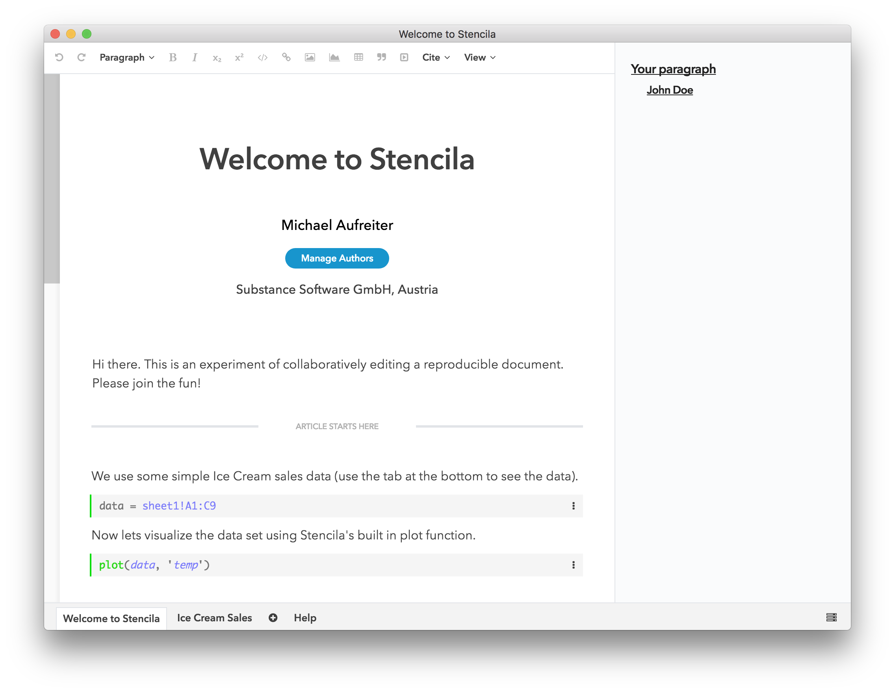

# My Reproducible Documents

Hello. Do you have 10 minutes to help us test a new open collaboration workflow for reproducible scientific documents?

Spoiler: *We'll be using Git for sharing and versioning and [Stencila Desktop](https://github.com/stencila/desktop) for editing.*




1. First clone this repo (or even better use your own fork).

    ```
    $ git clone https://github.com/michael/documents.git
    ```

2. Open Stencila Desktop.

    This will soon be just an app download. But until then install and run the development version like so:

    ```
    $ git clone https://github.com/stencila/desktop.git
    $ cd desktop
    $ npm install
    $ npm start
    ```

    *NOTE: You must have Node.js installed.*

3. Navigate to `.../documents/welcome-to-stencila` and open for editing.

4. Now add a paragraph to the button of the document, save the changes and consider pushing them to your fork and submitting a Pull Request on Github. I will merge asap!


*ATTENTION: With this workflow you are likely to experience merge issues, as Git does not work well with XML content. There are tools to help with [merging XML](https://joepairman.com/posts/xml-in-git-mercurial-watch-out-for-merges). In the long run we will additionally provide realtime collaboration, and automated merging of XML diffs.*

Please post any feedback in the [Stencila Community Forum](https://community.stenci.la/t/rfc-a-new-stencila-desktop/126/2).

Merci! :)
